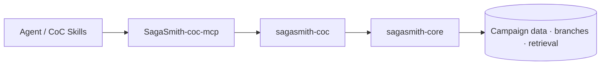

# SagaSmith CoC

[中文](README.md) · [English](README-en.md) · [Platform overview](https://github.com/SagaSmithAI/.github/blob/main/profile/README.md)

**The Call of Cthulhu 7e system runtime for SagaSmithAI.** This package registers the `coc7e` plugin on `sagasmith-core` and implements investigators, d100 checks, sanity, combat, chases, and investigation-scenario parsing.

> The cosmos may not care about an investigator. The runtime should at least remember exactly how much sanity they lost.

## Platform role



The independent [SagaSmith-coc-mcp](https://github.com/SagaSmithAI/SagaSmith-coc-mcp) now connects MCP-owned storage, Lobby/Play/Combat session exposure, scenario scene indexes, snapshots, branch-aware memory, actor-scoped knowledge authorization, and rules resolution. This repository remains the pure CoC runtime and JSON CLI; Agent integration and persistence belong to the MCP repository.

## Implemented capabilities

- **Investigators** — Classic/Pulp templates, characteristics, derived values, skills, development, and occupation shapes.
- **d100 checks** — regular/hard/extreme/critical/fumble, bonus/penalty dice, opposed rolls, and pushed rolls.
- **Sanity and insanity** — sanity loss, temporary/indefinite insanity, and symptom data.
- **Combat and chases** — melee, firearms, fight back/dodge, and chase state.
- **Scenario parsing** — ordinary scenarios, numbered solo nodes/transitions, and handout packs.
- **Scene semantics** — investigation/social/combat/chase/travel/reference types, Keeper/player/read-aloud visibility, clues, checks, and SAN metadata.
- **Shared Core services** — campaigns, characters, imports, scoped scene progress, branch snapshots, events, memory, and retrieval.

## Quick start

Requires Python 3.11+:

```bash
pip install "sagasmith-coc[documents]"
sagasmith-coc doctor --json
sagasmith-coc --help
```

```bash
sagasmith-coc campaign start --name "Arkham Files" --json
sagasmith-coc module inspect --path ./scenario.pdf --json
sagasmith-coc module ingest --campaign <id> --path ./scenario.pdf --json
sagasmith-coc check --campaign <id> --skill "Library Use" --score 65 --difficulty hard --json
sagasmith-coc sanity --campaign <id> --loss "1/1D6" --json
```

| Extra | Purpose |
|---|---|
| `documents` | PDF parsing |
| `dense` | sentence-transformers + ChromaDB |
| `all` | all optional runtime dependencies |

## Scenario parser contract

The parser distinguishes ordinary scenarios, numbered solo-scenario nodes with explicit transitions, and independent handout packs. Parsed metadata is provenance-bearing navigation assistance, not a replacement for source text. Clients must enforce `visibility`, filter Keeper-only material before display, and surface quality warnings when pages, clues, or SAN expressions are missing.

## Development

```bash
pip install -e ".[all,dev]"
pytest
ruff check .
```

## Content and license

Code is MIT licensed. Call of Cthulhu and related commercial content belong to their respective rights holders and are not distributed here. Users should import only material they are authorized to use.
