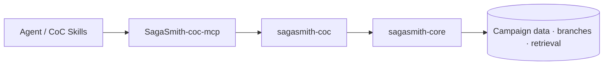

# SagaSmith CoC

[中文](README.md) · [English](README-en.md) · [平台总览](https://github.com/SagaSmithAI/.github/blob/main/profile/README.md)

**SagaSmithAI 的 Call of Cthulhu 7e 系统运行时。** 本仓库在 `sagasmith-core` 上注册 `coc7e` 插件，提供调查员、d100 检定、SAN、战斗、追逐和调查模组解析。

> 宇宙不关心调查员。运行时至少应准确记住他们失去了多少理智。

## 平台位置



独立的 [SagaSmith-coc-mcp](https://github.com/SagaSmithAI/SagaSmith-coc-mcp) 已接通 MCP-owned 存储、Lobby/Play/Combat session exposure、模组 scene index、Snapshot、分支记忆、角色级知识授权与规则判定。这个仓库继续专注纯 CoC 规则运行时和 JSON CLI；Agent 集成与持久化边界由 MCP 仓库负责。

## 已实现能力

- **调查员** — Classic/Pulp 模板、属性与派生值、技能、成长和职业数据形状。
- **d100 检定** — regular/hard/extreme/critical/fumble、奖励/惩罚骰、对抗与孤注一掷。
- **SAN 与疯狂** — 理智损失、临时与不定期疯狂、症状数据。
- **战斗与追逐** — 近战、远程、反击/闪避以及 chase 状态。
- **调查模组解析** — 普通场景、solo 编号节点与跳转、handout pack 三种 profile。
- **场景语义** — investigation/social/combat/chase/travel/reference 等类型，Keeper/player/read-aloud 可见性、线索、检定和 SAN 元数据。
- **Core 能力复用** — 战役、角色、导入、场景进度、分支 Snapshot、事件、记忆与检索。

## 快速开始

Python 3.11+：

```bash
pip install "sagasmith-coc[documents]"
sagasmith-coc doctor --json
sagasmith-coc --help
```

示例：

```bash
sagasmith-coc campaign start --name "阿卡姆档案" --json
sagasmith-coc module inspect --path ./scenario.pdf --json
sagasmith-coc module ingest --campaign <id> --path ./scenario.pdf --json
sagasmith-coc module index --campaign <id> --json
sagasmith-coc check --campaign <id> --skill "图书馆使用" --score 65 --difficulty hard --json
sagasmith-coc sanity --campaign <id> --loss "1/1D6" --json
```

| Extra | 用途 |
|---|---|
| `documents` | PDF 解析 |
| `dense` | sentence-transformers + ChromaDB |
| `all` | 全部可选运行时依赖 |

## 模组解析契约

解析器会自动区分：

1. **Scenario** — 常规调查场景与层级标题；
2. **Solo scenario** — 编号节点、显式跳转目标与图边；
3. **Handout pack** — 玩家资料、手记和可独立展示的文档。

解析元数据是有来源的辅助结构，不等于规则书原文。消费者必须尊重 `visibility`，在向玩家展示前过滤 Keeper-only 内容，并在缺少页码、线索或 SAN 表达式时处理质量警告。

## 开发

```bash
pip install -e ".[all,dev]"
pytest
ruff check .
```

## 内容与许可

代码使用 MIT License。Call of Cthulhu 及相关商业内容归其权利人所有，不随本仓库分发。用户仅应导入自己有权使用的规则书与模组。
