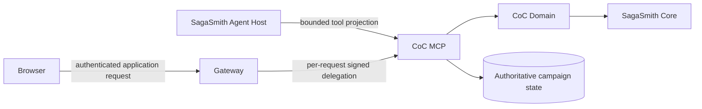

# SagaSmith Call of Cthulhu 7e

[Domain 中文](packages/domain/README.md) · [Domain English](packages/domain/README-en.md) ·
[MCP 中文](packages/mcp/README.md) · [MCP English](packages/mcp/README-en.md) ·
[Skills 中文](skills/README.md) · [Skills English](skills/README-en.md) ·
[Workbench](apps/ui/README.md) ·
[Platform](https://github.com/SagaSmithAI/.github/blob/main/profile/README.md)

SagaSmith CoC is the maintained vertical monorepo for Call of Cthulhu 7th
Edition. It ships a deterministic rules package, an authoritative MCP server,
Agent Skills, an authenticated gateway, and a Keeper-facing workbench. Those
components share one compatibility contract without collapsing their runtime or
distribution boundaries.

## Choose a path

| Goal | Start here |
|---|---|
| Run the text-only local MCP | `pip install sagasmith-coc-mcp` then `sagasmith-coc-mcp` |
| Embed the deterministic rules engine | `pip install sagasmith-coc` and read the [Domain guide](packages/domain/README-en.md) |
| Connect a modern Host | Read the [protocol matrix](packages/mcp/docs/protocol-compatibility.md) and [MCP guide](packages/mcp/README-en.md) |
| Load Keeper/Campaign Manager procedures | Read the [Skills guide](skills/README-en.md) |
| Develop the Keeper workbench | Read the [UI guide](apps/ui/README.md) |

Python 3.11+ is required. The workbench requires Node.js 22.12+.

## Repository layout

```text
packages/domain/              sagasmith-coc Python package and CLI
packages/mcp/                 sagasmith-coc-mcp server and gateway
apps/ui/                      CoC workbench
skills/                       Keeper and campaign procedures
skills/coc-module-generator/  CoC Pack authoring procedure
```

`sagasmith-core` remains an independent system-neutral dependency. D&D and CoC
have no source dependency on each other.

This repository is the current source of truth for every CoC component listed
above. The former standalone MCP, Skills, UI, and generic Module Generator
repositories are archived read-only; current issues, releases, integrations,
and documentation belong here.

## Architecture and authority


```mermaid
flowchart LR
    B[Browser] -->|authenticated application request| G[Gateway]
    H[SagaSmith Agent Host] -->|bounded tool projection| M[CoC MCP]
    G -->|per-request signed delegation| M
    M --> D[CoC Domain]
    D --> C[SagaSmith Core]
    M --> S[(Authoritative campaign state)]
```

- The Host owns the LLM, task planning, context assembly, and the bounded tool
  subset shown to the model.
- The MCP owns campaign/actor authorization, phase, revisions, idempotency,
  random streams, atomic settlement, and audience-filtered reads.
- The Domain package is pure deterministic CoC logic. It does not authenticate
  callers or own hosted workflow state.
- The browser is a projection and control surface. It never supplies an
  authoritative principal and does not read the domain database directly.

### Keeping the model-facing tool list small

Modern `tools/list` is a complete, deterministic, privately cacheable catalog
for an authorization scope. It does not mutate when a campaign changes phase or
another request opens an exposure. SagaSmith Hosts select a stable task/role/
phase facade from that catalog and show at most 16 tools to the model at once.
The 16-tool ceiling is a SagaSmith Host policy, not an MCP protocol limit.

This split protects tool-selection accuracy without making a hidden transport
session an authority boundary. The MCP revalidates identity, role, phase,
revision, and operation on every call. An `exposure_handle` is an expiring,
owner-bound catalog-navigation name—not a capability.

## MCP 2026-07-28

The modern path uses MCP 2026-07-28 request semantics:

- no `initialize`, protocol session, or `Mcp-Session-Id` authority;
- version, client capabilities, trace context, and target-specific
  `sagasmith.auth-context/v2` delegation on every request;
- optional `server/discover` and `Mcp-Method` / `Mcp-Name` HTTP routing;
- the same handlers, schemas, errors, and authority rules over stdio and
  Streamable HTTP;
- explicit campaign/revision parameters or server-issued owner/TTL handles for
  cross-call workflows;
- model-repairable tool failures as `isError: true` with structured recovery,
  while protocol/input failures remain JSON-RPC errors.

The explicit legacy adapter remains available for migration and rollback. Its
connection exposure and `tools/list_changed` behavior are compatibility
mechanisms, never the long-term security model. See the
[protocol compatibility matrix](packages/mcp/docs/protocol-compatibility.md).

## Local Agent Kit install profiles

The CoC-only text MCP does not require PDF, image, embedding, or vector stacks:

```bash
pip install sagasmith-coc-mcp
sagasmith-coc-mcp
```

That baseline provides SQLite state, Markdown/text content, FTS retrieval, and
the native MCP contract. Optional profiles are explicit:

```bash
pip install "sagasmith-coc-mcp[documents]"  # PDF text and page handling
pip install "sagasmith-coc-mcp[images]"     # visual PDF page review
pip install "sagasmith-coc-mcp[dense]"      # Domain embedding/vector stack
pip install "sagasmith-coc-mcp[all]"        # every implemented optional profile
```

The current CoC importer has no OCR execution path, so this repository does not
advertise a misleading `ocr` extra; scanned sources must first receive a legal,
reviewable text layer. Cross-system Local Agent Kit manifests remain owned by
`SagaSmith-agent`; this vertical repository owns only the CoC package/extras
contract.

## Hosted and local deployment

For stdio, one Agent owns one MCP process. For Streamable HTTP, start the MCP
and gateway separately; both transports execute the same `create_server()`
handlers. Non-loopback MCP HTTP requires a target-specific signing secret of at
least 32 bytes. Browser, gateway, and unrelated-audience bearer tokens must
never be forwarded as MCP authorization.

```powershell
$env:SAGASMITH_COC_MCP_TRANSPORT = "streamable-http"
$env:SAGASMITH_COC_MCP_HTTP_PORT = "8769"
$env:SAGASMITH_AUTH_CONTEXT_SECRET = "<32-byte-or-longer-secret>"
sagasmith-coc-mcp

# another terminal
$env:SAGASMITH_COC_MCP_URL = "http://127.0.0.1:8769/mcp"
$env:SAGASMITH_COC_GATEWAY_PORT = "8768"
sagasmith-coc-gateway
```

Loopback-only development may omit the signing secret. Before production use,
configure an authenticated gateway origin/token policy and place MCP behind a
trusted workload boundary. See the [MCP runbook](packages/mcp/README-en.md) for
all supported environment variables and backup/rollback requirements.

## Verified integration baseline

The 2026-08-20 hosted regression remains the legacy compatibility baseline. The
current release line adds MCP 2026-07-28, per-request auth-context v2, a stable
catalog with bounded Host projection, modern/legacy × stdio/HTTP contract tests,
and ten independently solved read-only MCP evaluations. The CoC reference
campaign has also run concurrently with the D&D reference campaign. These are
repeatable compatibility checks, not a claim that every scenario path has been
played.

## Development

```bash
uv sync --all-packages --all-extras
uv run --package sagasmith-coc pytest packages/domain/tests
uv run --package sagasmith-coc-mcp pytest packages/mcp/tests
uv run ruff check packages/domain packages/mcp

npm ci
npm run test:ui
npm run build:ui
```

MCP-focused validation additionally covers deterministic catalogs, authorization
and cache isolation, schemas/structured errors, trace propagation, bounded
pagination, idempotent writes, stale revisions, restart recovery, and the real
transport/protocol matrix. Tests use deterministic fixtures rather than
production campaigns or paid model services.

All MCP collection facades use the same bounded `query`/`limit`/opaque-`cursor`
shape and return `next_cursor` plus `has_more`. Campaign-event and state-revision
history forward cursor offsets to the Core authority layer, including regression
coverage that reaches records after item 100. Actor-memory projections also resolve
bounded exact `event:<id>` references through Core actor/audience policy. The locked
CI lane pins Core `59173c2fe3b80637a0890062dff381b38aa325fe` for those contracts;
the compatibility lane continues to verify current Core `main`.

## Upgrade, rollback, and content safety

Upgrade the compatible set in this order: Core, this dual-era MCP/Domain, then
Agent/Host and Web component locks. Back up the stopped, WAL-settled SQLite
database (or use the external database's consistent backup) before schema
changes. A rollback restores the database and matching Core/CoC/MCP component
set together; do not downgrade only the SDK while a Host still sends modern
request semantics.

Commercial rulebooks, scenarios, extracted text, and source assets are not
distributed here. Import only material you are authorized to use. Private
sources, renders, and Pack archives remain local by default.

Original code and Skill content are licensed under Apache-2.0. Call of Cthulhu
and related commercial content remain the property of their respective rights
holders.
