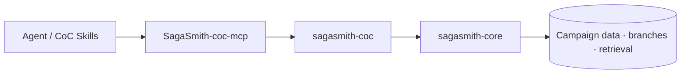

# SagaSmith CoC

[中文](README.md) · [English](README-en.md) · [Website](https://sagasmithai.github.io) · [Platform overview](https://github.com/SagaSmithAI/.github/blob/main/profile/README.md) · [SagaSmith Web](https://github.com/SagaSmithAI/SagaSmith-service) · [Content catalog](https://github.com/SagaSmithAI/SagaSmith-dnd-content-library)

> Current source lives at `sagasmith-coc/packages/domain` and is versioned with the sibling MCP, Skills, and UI; the former split repositories are archived.

**The Call of Cthulhu 7e system runtime for SagaSmithAI.** This package registers the `coc7e` plugin on `sagasmith-core` and implements investigators, d100 checks, sanity, combat, chases, and investigation-scenario parsing.

> The cosmos may not care about an investigator. The runtime should at least remember exactly how much sanity they lost.

## Platform role



The independently packaged [SagaSmith-coc-mcp](../mcp) connects MCP-owned storage, Lobby/Play/Combat session exposure, scenario scene indexes, snapshots, branch-aware memory, actor-scoped knowledge authorization, and rules resolution. The Domain package remains the pure CoC runtime and JSON CLI; Agent integration and persistence belong to the MCP package.

## Implemented capabilities

- **Investigators** — Classic/Pulp templates, characteristics, derived values, skills, development, and occupation shapes.
- **d100 checks** — regular/hard/extreme/critical/fumble, bonus/penalty dice, source-correct opposed ties, pushed-roll state, and exact Spending Luck options. Luck cannot buy a Critical or alter a pushed, fumbled, Luck, SAN, damage, or malfunction roll.
- **Combined, group Luck, and development mechanics** — one shared percentile result compared against Keeper-declared `any` or `all` traits, deterministic lowest-Luck group candidates, and checked-skill improvement rolls with bounded mastery rewards.
- **Sanity and insanity** — sanity loss, temporary/indefinite insanity, and symptom data.
- **Combat and chases** — DEX/readied-firearm order, stable ties, next-round joins, fight back/dodge, outnumbering dice, multiple attacks, dive-for-cover forfeits, Grid/Agent spatial boundaries, melee, firearms, and chase checks.
- **Chase state** — explicit CON/Drive Auto/Pack-defined speed checks, action points relative to the slowest effective MOV, deterministic DEX order, point consumption, route position, distance, round reset, and source-explicit outcomes. The engine no longer invents a skill as `MOV*5`.
- **Damage and recovery** — deterministic extreme/impaling damage, HP, major wounds, CON checks, unconsciousness, dying, death, First Aid, and treatment transitions.
- **Scenario parsing** — ordinary scenarios, numbered solo nodes/transitions, and handout packs.
- **Scene semantics** — investigation/social/combat/chase/travel/reference types, Keeper/player/read-aloud visibility, clues, checks, and SAN metadata.
- **Unified Content Packs** — compiles reviewed Core module descriptors into `sagasmith.content-package` schema v2 archives and validates CoC-specific sourced play-profile, catalog, and ending decisions.
- **Replayable randomness** — a SHA-256 counter stream persists positions and receipts across snapshots; d100, damage, development, and madness tables share the authoritative source.
- **Shared Core services** — campaigns, characters, imports, scoped scene progress, branch snapshots, events, memory, and retrieval.

## Quick start

Requires Python 3.11+:

```bash
pip install "sagasmith-coc[documents]"
sagasmith-coc doctor --json
sagasmith-coc --help
```

```bash
sagasmith-coc campaign start --name "Arkham Files" --json
sagasmith-coc module inspect --path ./scenario.pdf --json
sagasmith-coc module ingest --campaign <id> --path ./scenario.pdf --json
sagasmith-coc check --campaign <id> --skill "Library Use" --score 65 --difficulty hard --json
sagasmith-coc sanity --campaign <id> --loss "1/1D6" --json
```

| Extra | Purpose |
|---|---|
| `documents` | PDF parsing |
| `dense` | sentence-transformers + ChromaDB |
| `all` | all optional runtime dependencies |

## Scenario parser contract

The parser distinguishes ordinary scenarios, numbered solo-scenario nodes with explicit transitions, and independent handout packs. Parsed metadata is provenance-bearing navigation assistance, not a replacement for source text. Clients must enforce `visibility`, filter Keeper-only material before display, and surface quality warnings when pages, clues, or SAN expressions are missing.

## Development

```bash
pip install -e ".[all,dev]"
pytest
ruff check .
```

## Content and license

Original code is licensed under Apache-2.0. Call of Cthulhu and related commercial content belong to their respective rights holders and are not distributed here. Users should import only material they are authorized to use.
