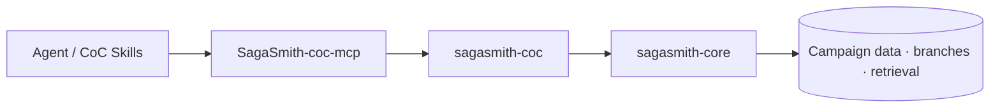

# SagaSmith CoC

[中文](README.md) · [English](README-en.md) · [官网](https://sagasmithai.github.io) · [平台总览](https://github.com/SagaSmithAI/.github/blob/main/profile/README.md) · [托管服务](https://github.com/SagaSmithAI/SagaSmith-service) · [内容目录](https://github.com/SagaSmithAI/SagaSmith-dnd-content-library)

**SagaSmithAI 的 Call of Cthulhu 7e 系统运行时。** 本仓库在 `sagasmith-core` 上注册 `coc7e` 插件，提供调查员、d100 检定、SAN、战斗、追逐和调查模组解析。

> 宇宙不关心调查员。运行时至少应准确记住他们失去了多少理智。

## 平台位置



仓内独立包 [SagaSmith-coc-mcp](../mcp) 已接通 MCP-owned 存储、Lobby/Play/Combat session exposure、模组 scene index、Snapshot、分支记忆、角色级知识授权与规则判定。Domain 包继续专注纯 CoC 规则运行时和 JSON CLI；Agent 集成与持久化边界由 MCP 包负责。

## 已实现能力

- **调查员** — Classic/Pulp 模板、属性与派生值、技能、成长和职业数据形状。
- **d100 检定** — regular/hard/extreme/critical/fumble、奖励/惩罚骰、来源一致的对抗平局、孤注一掷状态和精确 Spending Luck 选项；Luck 不能购买大成功，也不能修改孤注一掷、大失败、Luck、SAN、伤害或武器故障骰。
- **组合检定、团体 Luck 与成长** — 用一次共享 d100 对比 Keeper 声明的 `any/all` 特征，确定性找出现场 Luck 最低者，并对已勾选技能执行有界的会后成长与 mastery 奖励。
- **SAN 与疯狂** — 理智损失、临时与不定期疯狂、症状数据。
- **战斗与追逐** — DEX/准备枪械顺序、稳定同值次序、下一轮加入、反击/闪避、围攻奖励骰、每轮多次攻击、俯身找掩护、Grid/Agent 空间边界，以及近战、远程与 chase 判定。
- **追逐状态** — 使用明确的 CON/Drive Auto/Pack 技能做速度检定，以最慢有效 MOV 计算行动点，并确定性维护 DEX 顺序、行动点消耗、路线位置、距离、回合重置和来源明确的结束结果；不再用 `MOV*5` 猜测技能值。
- **伤害与恢复** — 极难/贯穿伤害、HP、重伤、CON、昏迷、濒死、死亡、急救与治疗的确定性状态转换。
- **调查模组解析** — 普通场景、solo 编号节点与跳转、handout pack 三种 profile。
- **场景语义** — investigation/social/combat/chase/travel/reference 等类型，Keeper/player/read-aloud 可见性、线索、检定和 SAN 元数据。
- **统一 Content Pack** — 将审核后的 Core 模组描述编译为 `sagasmith.content-package` schema v2，校验 CoC 7e 的人数、规则模式、年代、预生成调查员、solo 支持、目录与结局证据，并生成可校验的确定性归档。
- **可复现随机流** — SHA-256 counter 随机流、位置与收据可随战役 Snapshot 保存和恢复；d100、伤害、成长与疯狂表共享同一权威随机源。
- **Core 能力复用** — 战役、角色、导入、场景进度、分支 Snapshot、事件、记忆与检索。

## 快速开始

Python 3.11+：

```bash
pip install "sagasmith-coc[documents]"
sagasmith-coc doctor --json
sagasmith-coc --help
sagasmith-coc database upgrade --json
```

`database upgrade` 要求数据库符合当前 Snapshot schema v8：每个完整状态文档都以独立、checksum 有效的 `zlib-1` 记录保存。执行前必须停止写入并创建一致性数据库备份。当前格式没有 downgrade；回滚需恢复成套的数据库以及匹配的 Core/CoC 版本。

示例：

```bash
sagasmith-coc campaign start --name "阿卡姆档案" --json
sagasmith-coc module inspect --path ./scenario.pdf --json
sagasmith-coc module ingest --campaign <id> --path ./scenario.pdf --json
sagasmith-coc module index --campaign <id> --json
sagasmith-coc check --campaign <id> --skill "图书馆使用" --score 65 --difficulty hard --json
sagasmith-coc sanity --campaign <id> --loss "1/1D6" --json
```

| Extra | 用途 |
|---|---|
| `documents` | PDF 解析 |
| `dense` | sentence-transformers + ChromaDB |
| `all` | 全部可选运行时依赖 |

## 模组解析契约

解析器会自动区分：

1. **Scenario** — 常规调查场景与层级标题；
2. **Solo scenario** — 编号节点、显式跳转目标与图边；
3. **Handout pack** — 玩家资料、手记和可独立展示的文档。

解析元数据是有来源的辅助结构，不等于规则书原文。消费者必须尊重 `visibility`，在向玩家展示前过滤 Keeper-only 内容，并在缺少页码、线索或 SAN 表达式时处理质量警告。

## 开发

```bash
pip install -e ".[all,dev]"
pytest
ruff check .
```

## 内容与许可

原创代码使用 Apache-2.0。Call of Cthulhu 及相关商业内容归其权利人所有，不随本仓库分发。用户仅应导入自己有权使用的规则书与模组。
